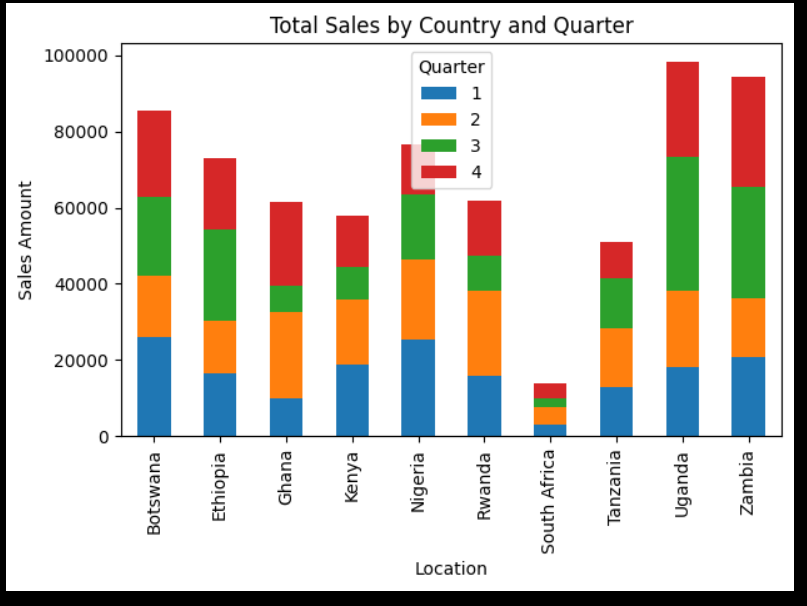

# DSA_2040_Practical_Exam_Suezan501 

# Project overview 

This project is split into four major tasks:

Database Design — Creating a structure to store sales data

OLAP Analysis — Running smart queries to answer business questions

Clustering & Classification — Using machine learning to find patterns

Association Rule Mining — Discovering which products are often bought together 

# Designing database (star schema)
I created three dimension tables ProductDim, CustomerDim and TimeDim and one fact table SalesFact. 
ProductionDim had; ProductID,ProductName,Category,and UnitPrice
CustomerDim had; CustomerID, Name, Location, Gender, Age
TimeDim had; Date, Month, Quarter, Year
SalesFact had; ProductID, CustomerID, TimeID, Sales Amount, Quantity

# Data generation 
Using python, I created synthetic data for each table 
This is the output

Synthetic data generated:
   InvoiceNo StockCode Description  Quantity InvoiceDate  UnitPrice  \
0  INV770487      P002  Smartphone         2  2024-04-18      74.41   
1  INV872246      P002  Smartphone        44  2025-02-20      74.33   
2  INV542417      P001      Laptop         2  2024-04-06      10.28   
3  INV127824      P009       Mouse        13  2025-07-30      71.89   
4  INV331148      P008    Backpack        38  2023-08-18      28.54   

   CustomerID   Country  
0          29  Tanzania  
1          12  Botswana  
2          65  Botswana  
3          70   Nigeria  
4          98  Tanzania  

I also transformed data for all the dimension tables 
Transformed Sales Data (Recent):
    InvoiceNo StockCode Description  Quantity InvoiceDate  UnitPrice  \
1   INV872246      P002  Smartphone        44  2025-02-20      74.33   
3   INV127824      P009       Mouse        13  2025-07-30      71.89   
8   INV678856      P005         Pen        41  2024-08-16      62.23   
10  INV205907      P007     Monitor        18  2024-08-19      45.89   
11  INV472528      P004    Notebook        43  2025-07-11      27.43   

    CustomerID       Country  TotalSales  
1           12      Botswana     3270.52  
3           70       Nigeria      934.57  
8           74        Rwanda     2551.43  
10          21  South Africa      826.02  
11          83        Uganda     1179.49  

Customer Summary:
   CustomerID  TotalSales       Country
0           1     7527.79  South Africa
1           2    12012.99        Zambia
2           3     9366.79        Uganda
3           4     2367.62        Uganda
4           5     6511.92        Zambia

I loaded the data into SQLITE using sqlite3 and connected the data with retail_dw.db
Then I did full ETL

# OLAP QUERIES
Did three OLAP queries; roll up, drill down and slice. 
In roll up I calculated total sales by country and quarter. It revealed that Uganda, Zambia and Botswana has the highest sales.
Drill down; Sales details for a specific country where I used South Africa
Slice; Did total sales for electronic category 

I used bar chart to visualize sales by country. And according to the data, Uganda had the highest sales amount followed by Zambia while South Africa had the least sales amount.

# Data mining 

